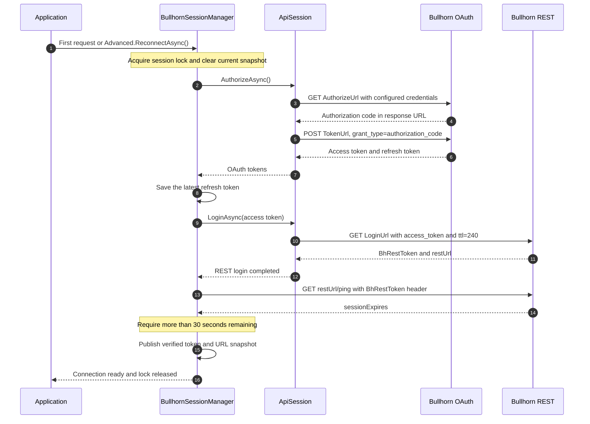
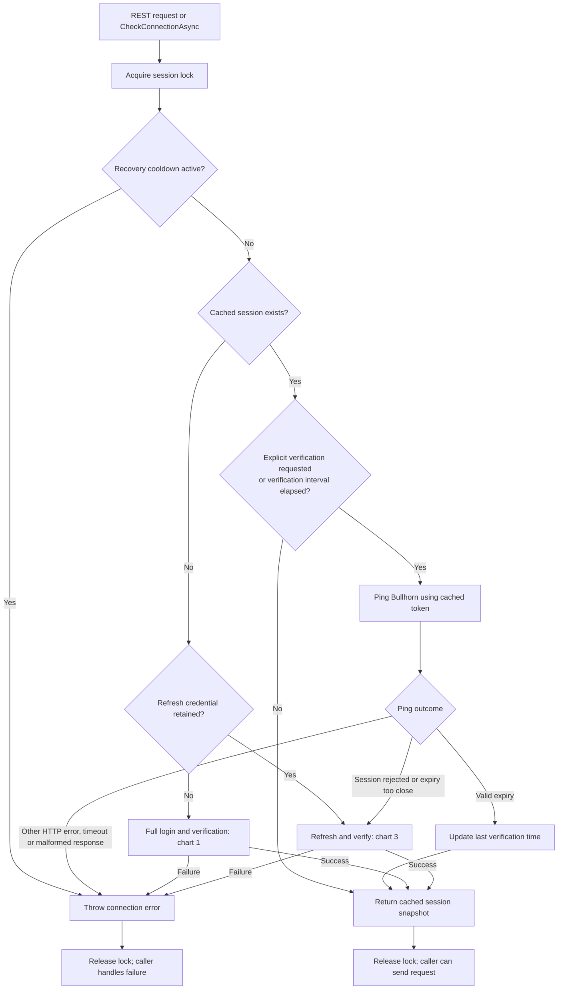
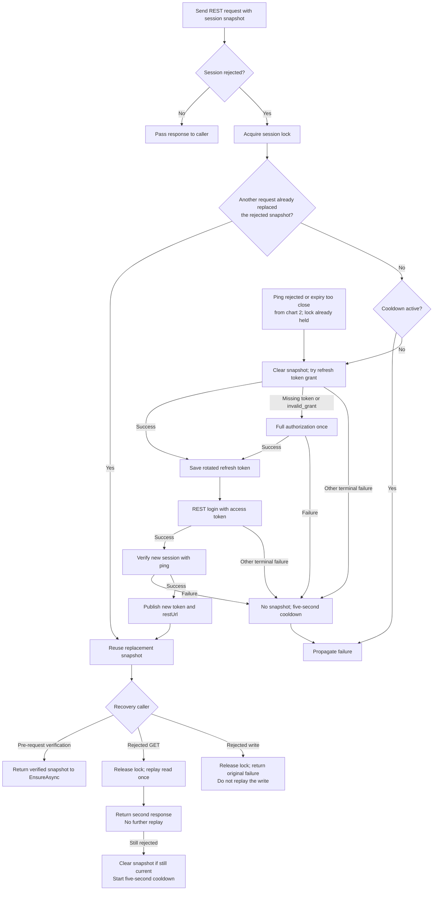
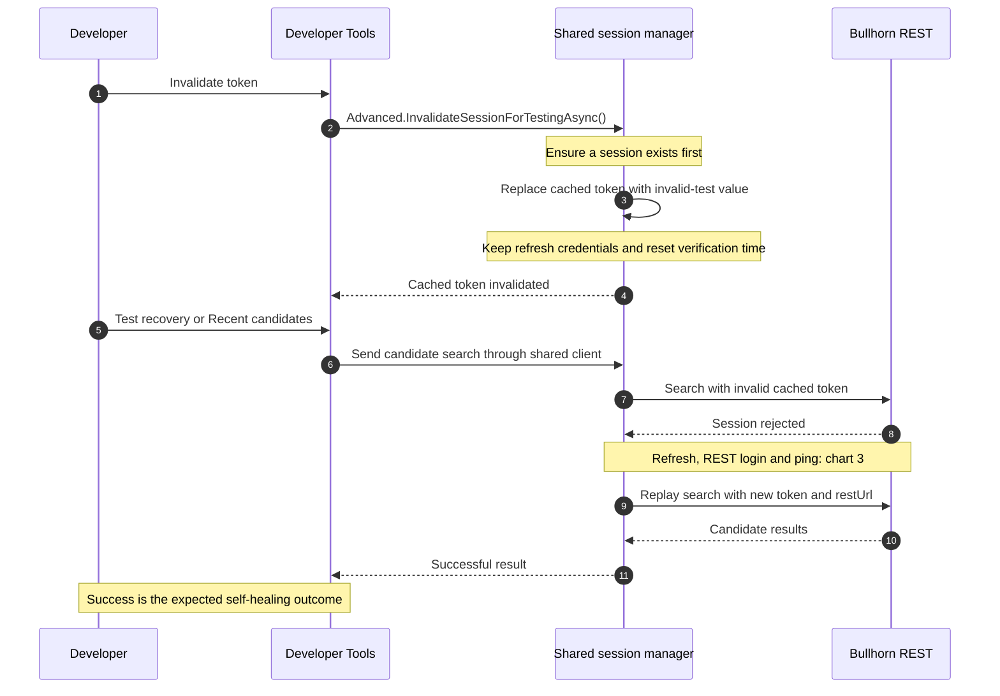

# Bullhorn API

This project aims to simplify your experience with the Bullhorn APIs by providing a C# and .NET Core implementation. It helps you explore Bullhorn APIs and speed up your development process.

## ⚠️ Important Note on Updating Bullhorn Entities

When updating Bullhorn entities, **make sure to update only the fields you want to change**. Do not use DTOs with multiple fields that you do not intend to update, as this will overwrite the existing Bullhorn entity with default values.

## ⚒️ Bullhorn API Browser

This Blazor application assists you in exploring the Bullhorn APIs. It uses the Bullhorn API client to interact with the Bullhorn APIs, allowing you to test the APIs through a user-friendly interface.


### 🔐 Setting Up secret.json

To get started, fill in the `secret.json` file with the Bullhorn credentials provided by Bullhorn. The following is a template of the `secret.json` file:

 ```json
 {
  "BullhornSettings": {
    "Soap": {
      "UserName": "",
      "Password": "",
      "ApiKey": ""
    },
    "RestApi": {
      "AuthorizeUrl": "https://auth.bullhornstaffing.com/oauth/authorize",
      "LoginUrl": "https://rest-emea.bullhornstaffing.com/rest-services/login",
      "TokenUrl": "https://auth.bullhornstaffing.com/oauth/token",
      "AuthorizationParameter": "code",
      "UserName": "",
      "Password": "",
      "ClientId": "",
      "Secret": ""
    }
  }
}
 ```

 Replace the empty strings with your specific Bullhorn credentials. Once you have completed the secret.json file, you will be able to use the Bullhorn API Browser to interact with Bullhorn APIs.

## Authentication and connection recovery

Bullhorn uses two authentication steps: OAuth produces an access token, then REST login exchanges that access token for a `BhRestToken` and a `restUrl`. Normal API requests use the **REST token**, not the OAuth access token.

These diagrams describe the current implementation. Start with the login sequence, then follow the session check and recovery flows.

| Value | Purpose |
| --- | --- |
| Authorization code | Exchanged for OAuth tokens during full authorization. |
| OAuth access token | Used to create a REST session through `LoginUrl`. |
| OAuth refresh token | Used to obtain new OAuth tokens without repeating full authorization. |
| `BhRestToken` + `restUrl` | Stored together as a session snapshot; used for REST requests and ping. Both can change after login. |

### 1. Initial login and forced reconnect

The first request with no cached session starts this sequence. `BullhornApi.Advanced.ReconnectAsync()` explicitly starts it again, even when a cached session exists.



The chart shows the successful path. A successful login response alone is not enough: the manager publishes the new session only after ping succeeds. A failed recovery leaves no current snapshot and starts a five-second cooldown.

### 2. What happens before a normal request?

Every REST request calls `EnsureAsync()`. `CheckConnectionAsync()` uses the same logic, so calling it does **not** necessarily make a network request. Verification is driven by requests; there is no background ping timer.



- `BullhornSettings.SessionVerificationInterval` defaults to **one minute**.
- `BullhornApi.Advanced.VerifyConnectionAsync()` requests an immediate ping when a session exists; with no session, it logs in and verifies the new one. It still respects the cooldown.
- Ping validity uses the server's expiry timestamp and a **30-second safety margin**.
- `CheckConnectionAsync()` catches connection-check exceptions and returns `false`; request and Advanced methods propagate failures.
- A recently verified session can still be rejected by the next request. The following recovery flow handles that case.

### 3. Automatic recovery and request replay

A session rejection means **HTTP 401**, or **HTTP 400/403** whose body contains `Bad BhRestToken`, `Invalid BhRestToken`, or `Expired BhRestToken` (case-insensitive). A generic permission error or timeout does not qualify.



The manager calls `ApiSession.RefreshAsync()` once when a refresh credential is available. A missing credential or an OAuth `invalid_grant` response (HTTP 400/401) selects full authorization once. Other errors, including `invalid_client`, timeouts and server failures, propagate without restarting authorization. After either grant succeeds, the manager saves the latest refresh token, calls `LoginAsync()` and verifies the resulting REST session.

`ApiSession` only performs authentication exchanges: it has no cached login, ping, validity or refresh-token state. The manager owns the refresh credential and the verified REST snapshot. A consumed refresh credential is cleared before its exchange; a replacement is retained immediately, even if subsequent REST login fails. After the cooldown, a retained replacement can be used for another recovery.

The lock protects session changes, not entire API requests. Concurrent requests can run normally, but only one recovery changes the shared session at a time. A request rejected with an old snapshot reuses a replacement already created by another request.

**There are two different retry limits:**

| Layer | Current behaviour |
| --- | --- |
| OAuth authorization and token exchange | **One attempt.** Never replay the grant automatically: authorization codes and refresh credentials may already have been consumed. Missing/rejected refresh credentials allow one full-authorization fallback. |
| REST login | **At most two attempts**, using the same access token. Retry after 500 ms only for HTTP **502, 503 or 504**. Other failures and cancellation propagate immediately. |
| Original REST read | Replayed **once** after session recovery. Persistent rejection is returned to the caller and invalidates the snapshot if still current. |
| Original REST write | **Never replayed automatically.** Recovery can repair the session for subsequent calls, but the failed write remains failed. |
| Failed recovery | Automatic attempts are blocked for **five seconds**. Explicit `ReconnectAsync()` bypasses this cooldown and forces full authorization. |
| HTTP pipeline registered by `AddBullhorn` | Polly's timeout is **20 seconds** per HTTP execution; no blanket transient-error retry policy is registered. The complete login/recovery sequence can take longer. |

Search/query endpoints throw on HTTP errors, malformed pages and detected incomplete pagination instead of returning a misleading empty or partial list. Successful empty results remain valid. Twenty360's service layer converts these exceptions to its existing `Result.Failure` responses. Advanced raw-response methods let the caller inspect the returned HTTP status.

### 4. Manual controls and invalid-token testing

Twenty360 exposes these controls under **Developer Tools > Diagnostics > Bullhorn connection**. System Monitor links to that page for users with the Developer Tools policy.



Invalidation changes only the cached token for this client; it does **not** revoke a token on Bullhorn. The refresh credentials remain available so automatic recovery can succeed.

`AddBullhorn` registers a singleton `IBullhornClient`. All consumers of that singleton, including background work in the same process, share its session. A background request may recover the token before the next button click. Other processes, such as automation workers, have separate sessions.

For a manual full-login test, invalidate the token and then click **Reconnect Bullhorn**. This uses `Advanced.ReconnectAsync()` instead of the refresh-first path. Clicking **Verify connection** after invalidation can also recover the session through ping before a search is sent.

Look for these log messages:

- `Bullhorn cached REST token invalidated for recovery testing.`
- `Bullhorn refresh unavailable or rejected; starting full authorization.` (only when the refresh fallback is used)
- `Bullhorn session recovered and verified.` (also emitted after initial login and manual reconnect)

A successful candidate request alone does not identify which request performed recovery; correlate it with the invalidation and recovery logs.

### Why these steps remain

Bullhorn documents the OAuth-to-REST-login sequence and recommends reusing the REST session until it expires. Its OAuth documentation also states that refresh tokens are replaced after use. Those requirements explain the separate exchanges and coordinated credential updates; the retry limits above are this library\'s policy.

- [Getting started with REST](https://bullhorn.github.io/Getting-Started-with-REST/)
- [Bullhorn OAuth authorization](https://bullhorn.github.io/docs/oauth/)

### Implementation reference

- [BullhornSessionManager](src/ApiBureau.Bullhorn.Api/Http/BullhornSessionManager.cs): locking, cached verification, recovery, cooldown and invalidation.
- [ApiSession](src/ApiBureau.Bullhorn.Api/Http/ApiSession.cs): Stateless OAuth authorization, refresh grants and REST login.
- [BullhornHttpClient](src/ApiBureau.Bullhorn.Api/Http/BullhornHttpClient.cs): authenticated requests, single read replay and error propagation.
- [BullhornAdvancedClient](src/ApiBureau.Bullhorn.Api/BullhornAdvancedClient.cs): public verification, reconnect and testing controls.
- [Recovery tests](test/ApiBureau.Bullhorn.Api.Tests/README.md): fake-server regression suite and manual testing steps.

## Contributors
This project adheres following guidelines.
- https://github.com/dotnet/runtime/blob/main/docs/coding-guidelines/coding-style.md
- https://github.com/dotnet/runtime/tree/main/docs#coding-guidelines

## Code of Conduct
This project has adopted the [Microsoft Open Source Code of Conduct](https://opensource.microsoft.com/codeofconduct/). For more information see the [Code of Conduct FAQ](https://opensource.microsoft.com/codeofconduct/faq/).
